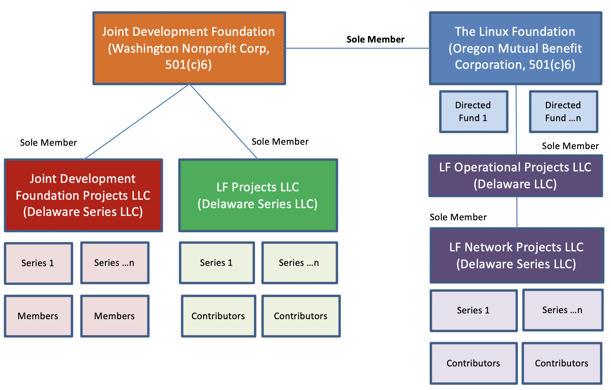
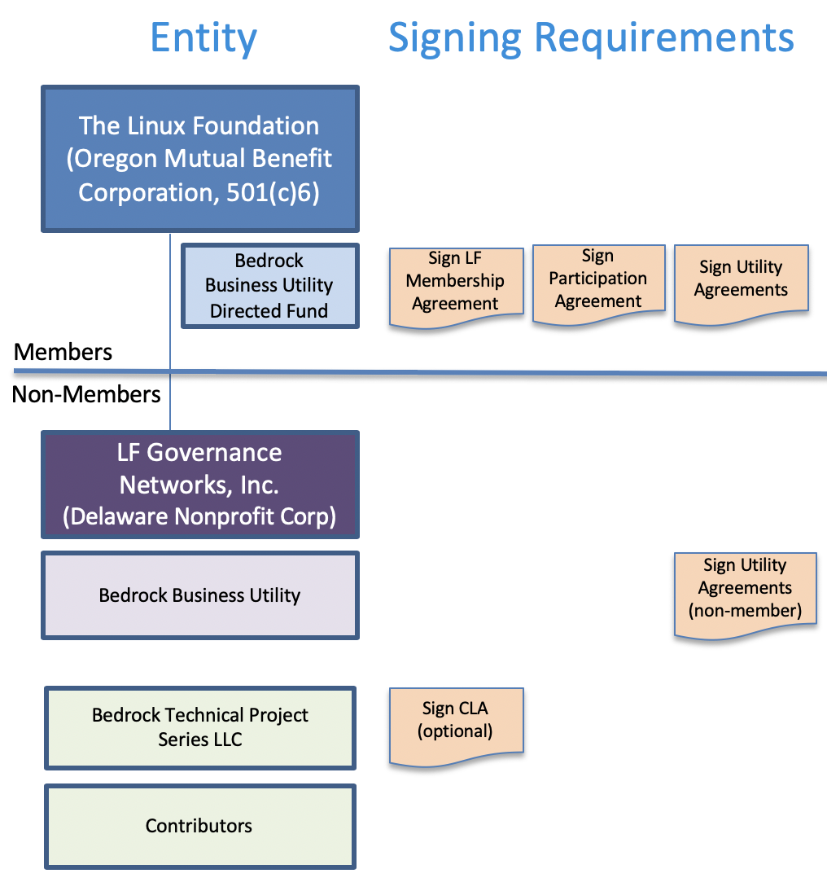

## Non-Profit Organization
The **Bedrock Consortium** ("Consortium") is a project of the Linux Foundation and is backed by members that share a common interest in collaborating on the delivery of the infrastructure and governance necessary for a dedicated and trusted public identity utility based on decentralized identity technology. The utility is intended to reliably serve the verifiability of both physical and online digital identity interactions. The Consortium is focused on the governance of a dedicated decentralized identity utility for the exchange fo trusted data. The Consortium represents a formal Trust Community consisting of participating members that adhere to the *Bedrock Business Utility Governance Framework* ("BBU-GF").

### Legal Entity Structure
The [Linux Foundation](https://www.linuxfoundation.org/) (the “LF”) is dedicated to building sustainable ecosystems around open source projects to accelerate technology development and industry adoption. It provides support for open source communities through financial and intellectual resources, infrastructure, services, events, and training. The LF also provides a proven legal structure for the establishment of open source projects as non-profit legal entities for members.

Activity Type | Entity Name | Legal Structure | Purpose |
| --- | --- | --- | --- |
| Directed Fund | Bedrock Consortium Directed Fund | The Linux Foundation, (Oregon Mutual Benefit Corporation, 501(c)6) | The **Bedrock Consortium** is a directed fund of the Linux Foundation. The Directed Fund uses a Project Participation Agreement that specifies funding commitments, policies, governance and customized utility utility agreements (with the utility agreements hosted by LF Governance Networks, Inc.). |
| Utility | Bedrock Business Utility | LF Governance Networks Inc, LLC (Delaware Non-Profit Corp) | The **Bedrock Business Utility ("BBU")** is an independent self-governed public identity utility enabled by the utility agreements, a collection of legal instruments specified under a governance framework. |
| Technical Project | Bedrock Technical Project | LF Projects LLC (Delaware Series LLC)  | An LF affiliate entity that hosts open source projects such as the **Bedrock Technical Project**. Each open source project is associated with a Technical Charter setup as its own Series LLC under the LF Projects LLC. |

### Legal Entity Registration
The *Bedrock Consortium* (the “Directed Fund”), is a directed fund project of the LF. The Directed Fund serves two purposes:

1. Manage the operation and maintenance of the *Bedrock Business Utility* (“the Utility”).
2. Support for the *Bedrock Technical Project* (the “Technical Project”), an open source project, a LF Network Projects.

### Membership Signing Requirements
Participation in or use of a project entity may require the signing of one or more contractual instruments.

| Activity Type | Entity Name | Contractual Instruments |
| --- | --- | --- |
| Directed Fund | Bedrock Consortium Directed Fund | LF Membership Agreement, BBU Participation Agreement, and Utility Agreements. |
| Utility | Bedrock Business Utility | Utility Agreements, USP Contracts |
| Technical Project | Bedrock Technical Project | None |

The [Bedrock Consortium Participation Agreement](../gf_legal/contracts/bbu_partnership_agreement.docx) binds members to project funding commitments, policies, etc. It also puts forth a project charter that addresses the governance of directed fund and customized requirements for *Utility Agreements*.

For details pertaining to Utility Agreements, see "Exhibit B" of the Bedrock Consortium Charter (Exhibit B to the Bedrock Consortium Participation Agreement).

The *Bedrock Technical Project* does not require the signing of a *Contributors License Agreement (CLA)*.

### Consortium Name
The name of the member-driven funding entity supporting the BBU is the Bedrock Consortium. The membership of the Bedrock Consortium shares a keen interest towards the establishment of trusted commerce. They believe in a set of fundamental *privacy by design principles* while mitigating financial and regulatory compliance risks.

The term “Bedrock” carries two pertinent meanings:

1. Gold accumulates at this solid foundational layer of the earth because water can't "wash it down" any further. The implication here is that our public identity utility ledger is the bedrock for business trust worldwide.
2. A “bedrock” principle is one that forms the basis for others principles. Our public identity utility ledger aims to provide the foundational principles for the exchange of trusted personal data.

## Governing Board
The business of the Bedrock Consortium is overseen by a Governing Board.  The Governing Board is comprised of representatives from members as outlined in the Bedrock Consortium’s Charter. See the *Bedrock Consortium Participation Agreement*.

## Governance Framework
The Governing Board is responsible for establishing and maintaining the governance framework for the operation and administration of the Bedrock Business Utility ("BBU") . See the *Bedrock Consortium Charter* (Exhibit B to the Bedrock Consortium Participation Agreement).
