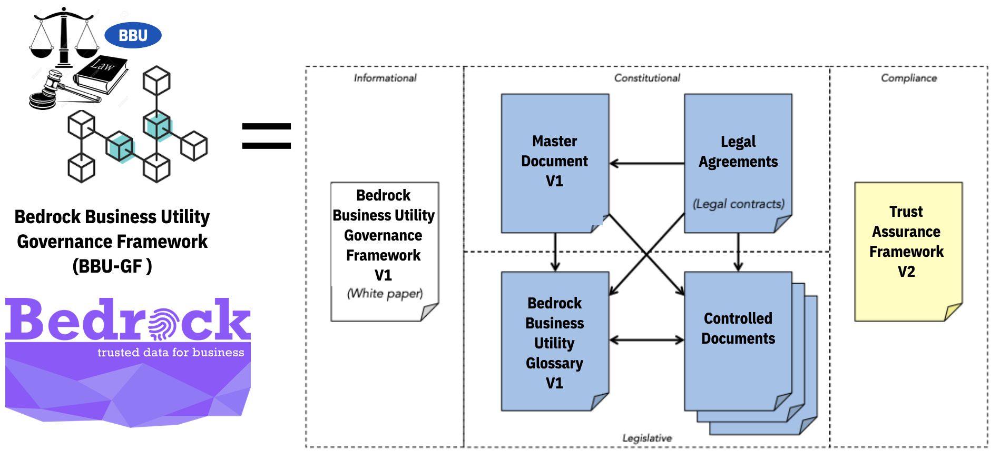

## Preface
This is an official document of the ​Bedrock Business Utility Governance Framework​ ("BBU-GF"). If you have comments or suggestions, we invite you to submit them using our [issue tracker](https://github.com/bedrock-consortium/bbu-gf/issues). If you are interested in joining the Bedrock Consortium, please feel free to [contact us](https://bedrock-consortium.github.io/bbu-gf/contact_us/).

## Version Control

* **Version**: 0.2
* **BoD Approval Date**: TBD
* **Comments**: Ratification of the BBU-GF will take place upon the formation of the BoD (at first meeting).
* **Status**: BBU Governance Framework Working Group is currently developing the BBU-GF.

## Acknowledgements
​This document was produced on behalf of the BBU Board of Directors by the BBU Governance Framework Working Group.

## Introduction
The purpose of the Bedrock Business Utility is to provide a decentralized global public utility for trusted commerce.
The Bedrock Governance Framework (the "BBU-GF") serves as the *constitution* for the *Bedrock Business Utility*. It represents an instance of a [ToIP Layer One Public Utility Governance Framework](https://trustoverip.org/working-groups/governance-stack/) under the guidance of the [ToIP Utility Foundry Working Group](https://trustoverip.org/working-groups/utility-foundry/).


The BBU-GF leverages the principles, policies, terminology, and standards necessary to enable trusted digital commerce based on decentralized identity.

A key objective of the BBU-GF is to address any concerns or risks that Consortium members may have as Utility participants. For example, compliance with Data Protection Regulations such as the EU General Data Protection Regulation (GDPR), the California Consumer Privacy Act (CCPA), and the Canadian Personal Information Protection and Electronic Documents Act (PIPEDA).

The purpose of the Bedrock Consortium is to administer decentralized governance for Bedrock Business Utility.

## Governance Framework

### Governance Documents
The BBU-GF formally consists of a set of interrelated documents that collectively form the governance model for the Directed Fund and the Utility that the Consortium manages. The documents are organized in three (3) categories; Blue = Normative, Yellow = Assessment, White = Informative.



| Category | Name | Description |
| --- | --- | --- |
| Primary (White) | Bedrock GF Whitepaper | Introduction to the Bedrock Governance Framework Version 1|
| Primary (Blue) | Bedrock Governance Framework (BBU-GF) Master Document | The “constitution” of the Consortium, this document defines the purpose, core principles, and core policies, and also references all other documents in the GF. |
| Primary (Blue)| Bedrock Glossary | A comprehensive glossary of terms used throughout all the BBU-GF documents |
| Primary (Yellow)| Bedrock Trust Assurance Framework | This document defines criteria and processes for assessing conformance of consortium stakeholders to the policies of the BBU-GF.|
| Legal (Blue)| Bedrock Business Utility Participation Agreement | Contractual instrument between the Consortium and a member. |
| Legal (Blue)| Bedrock Steward Agreement | Contractual instrument between the Consortium and a Governing or Operational Member. |
| Legal (Blue)| Bedrock Steward Data Processing Agreement | Contractual instrument between the Consortium and a Governing or Operational Member. |
| Legal (Blue)| Bedrock Transaction Endorser Agreement | Contractual instrument between the Consortium and a Governing, Operational or Subscriber Member. |
| Legal (Blue)| Bedrock Transaction Endorser Data Processing Agreement | Contractual instrument between the Consortium and a Governing, Operational or Subscriber Member.  |
| Legal (Blue)| Transaction Author Agreement |Contractual instrument between the Consortium and any person or organization initiating a write transaction to the Utility.|
| Controlled Documents (Blue)| Governing Body Policies | The governance policies that apply to all BBU Governing Bodies.|
| Controlled Documents (Blue)| Ledger Access Policies | Governing policies for reading and writing to the Utility and the processing of BBU transactional data. |
| Controlled Documents (Blue)| Member Business Policies |Governing qualification, application, activation, operation, suspension, and termination of members.|
| Controlled Documents (Blue)| Member Technical Policies |Governing the security, node operation, node selection, and reporting requirements for members.|
|Controlled Documents (Blue)| Economic Policies | Governing economic incentives, fees, and regulatory compliance and budgetary management.|
|Controlled Documents (Blue)| Bedrock Certification Mark Policies |Governing the establishment of and use of the Bedrock Certification policies for ecosystem stakeholders. |

### Core Principles
See [BBU Principles](./principles.md).

## Core Polices
In keeping with all Core Principles and especially the Decentralization by Design and Security by Design principles:

1. Policies, practices, procedures, and algorithms governing participation of [Stewards](./glossary.md) and operation of Nodes MUST follow all Core Principles.
2. The Consortium MUST publish the following Controlled Documents managed as specified by BBU Governing Bodies:​
a. Member Business Policies
b. Member Technical Policies​
c. Ledger Access Policies
​
### Inclusion
In keeping with the Inclusive by Design principles but in recognition of the permissioned write structure of the Bedrock Business Utility:

1. Read access to the Bedrock Business Utility MUST be open to all types of entities.  
2. Write access will be limited to members and non-members in good standing within the Consortium.
3. Write access will be limited to members and non-members that have signed the necessary ```Network Agreements```. See ```Exibit B``` of the Participation Agreement.

### Trust Assurance
In keeping with all Core Principles and especially the Decentralization by Design principles:

1. The Consortium MUST specify policies, practices, and procedures for assessing conformance to the Bedrock Governance Framework by publishing and maintaining the Bedrock Trust Assurance Framework​ ​as a Controlled Document managed as specified by BBU Governing Bodies​. The Controlled Documents may leverage resources and guidance from the ToIP Foundation.
2. The Bedrock Consortium MUST publish a Bedrock Trust Mark Policies​ ​as a Controlled Document managed as specified by BBU Governing Bodies.​

## Economics
In keeping with the Sustainability principle:

1. The Consortium  MUST publish the ​Bedrock Economic Policies​ ​as a Controlled Document managed as specified by BBU Governing Bodies​ in conjunction with Consortium legal counsel.
2. The Consortium MUST manage Ledger Fees and any mechanism used for paying them to ensure economic viability and sustainability for the Consortium to keep with its charter as a non-profit public trust organization.
3. The Consortium MAY retain a qualified Auditor to publish an annual public audit of Consortium finances.

## Governance
The Bedrock Governance Framework Master Document and the Controlled Documents listed in ```Appendix A``` shall be revised from time to time. The policies in this section govern this process and procedures for managing document lifecycles.

### General
1. The Consortium MUST publish BBU Governance Bodies as a Controlled Document managed by the Board of Directors.
2. BBU Governance Bodies MUST specify the Sovrin Governing Body for each Controlled Document.
3. All BBU-GF documents, including Controlled Documents, MUST use keywords in policies as defined in [IETF RFC 2119](https://tools.ietf.org/html/rfc2119).
4. All BBU-GF documents MAY be revised to add non-normative
content, such as references to appendices, white papers, or other explanatory materials, without triggering a formal revision review process as defined in this ```Governance Section```.

### Source Control
All BBU-GF documents will reside in a [Github source control repository](https://github.com/bedrock-consortium/bbu-gf) and will use the associated [Issue Tracker](https://github.com/bedrock-consortium/bbu-gf/issues/) for change management.

### Approved Framework Process
1. Stable versions of the BBU-GF must be approved by the Board of Directors.
2. Approved versions need to be specified in the ```Version Control``` section of this document.
3. A static PDF file associated with the approved version MUST be stored in the ```/pdf/approved``` folder of the GitHub repo.
4. ```Appendix A``` of this document must be updated to point to the newly approved PDF file.

### Master Document Revisions
These policies apply to any normative revision to the present document, exclusive of ```Appendix A```.
1. Revisions to the BBU-GF Master Document MUST respect the Purpose and Core Principles.
2. The commencement of any revision process MUST be publicly announced by the Consortium no later than the time of commencement.
3. Decisions in the revision process is restricted to the Board of Directors and SHOULD consider input from all BBU members.
4. Proposed revisions MUST be publicly announced by the Consortium.
5. Revisions MUST be approved by a supermajority vote of at least two-thirds of the Board of Directors and before the revision takes effect.

### Controlled Document Revisions
These policies apply to any normative revision to the Controlled Documents listed in ```Appendix A```.
1. The list of Controlled Documents in Appendix A, as well as each Controlled Document on that list, MAY be revised independently from the BBU-GF Master Document (the present document).
2. A Controlled Document MUST be stored in and use the source control mechanisms established in this ```Governance Section```.
4. Revisions to a Controlled Document MUST be approved by the Board of Directors before the revision takes effect.

## Appendix A: Controlled Documents
The following Controlled Documents are normative components of the BBU-GF. All framework content is published by the Consortium in three forms:

1. A static PDF document representing the entire governance framework in a single document.
    * [Latest compilation of material from the GitHub Repo](../../pdf/bedrock-business-utility-gf.pdf)
    * [Official Board of Directors Approved Version](../../pdf/approved/bedrock-business-utility-gf-v1.pdf)
2. A sub-section of the [BBU website](https://bedrock-consortium.github.io/bbu-gf/) so that all documentation is easily navigated.  
3. Independent markdown files (```.md```) in the [GitHub Repo](https://github.com/bedrock-consortium/bbu-gf).

### Definitions

| Document Name | Description | Governed By |
| --- | --- | --- |
| BBU Glossary | Definitions of all terms used in the BGF | Governance Framework Working Group |
| Governing Bodies | Definitions of governing bodies within the Consortium | Bedrock Board of Directors |
| Ledger Transaction Data|  Defines the data and metadata process by a Steward Node | Technical Steering Committee |

### Specifications

| Document Name | Description | Governed By |
| --- | --- | --- |
| Decentralized Identifiers | [Specification for DIDs and DID documents](https://w3c-ccg.github.io/did-spec/) | W3C Credentials Community Group |  |
| BBU DID Method 1.0 Specification | Specification for the BBU DID Root Namespace. See [Issue 13](https://github.com/bedrock-consortium/bbu-gf/issues/13) |  Technical Steering Committee |
| Verifiable Credentials Data Model 1.0 | [Specification for verifiable credentials](https://w3c.github.io/vc-data-model/) | W3C Verifiable Claims Working Group |

### Policies

| Document Name | Description | Governed By |
| --- | --- | --- |
| Governing Body Policies | Chartering and functioning of BBU Governing Bodies | Board of Directors |
| Ledger Access Policies | Read and write access to the Bedrock Business Utility | Governance Framework Working Group |
|  Member Business Policies | Member qualification, enrollment, and operational status | Membership Committee |
| Membership Technical Policies | Technical requirements for operating and protecting components of the BBU infrastructure. | Technical Steering Committee|
| Economic Policies | Budgetary policies for the BBU. | Finance Committee |
| Trust Mark Policies |Acceptable uses of the Bedrock Trust Mark| Governance Framework Working Group |

### Frameworks
| Document Name | Description | Governed By |
| --- | --- | --- |
| Trust Assurance Framework | Trust assurance for BGF actors |  Governance Framework Working Group |
