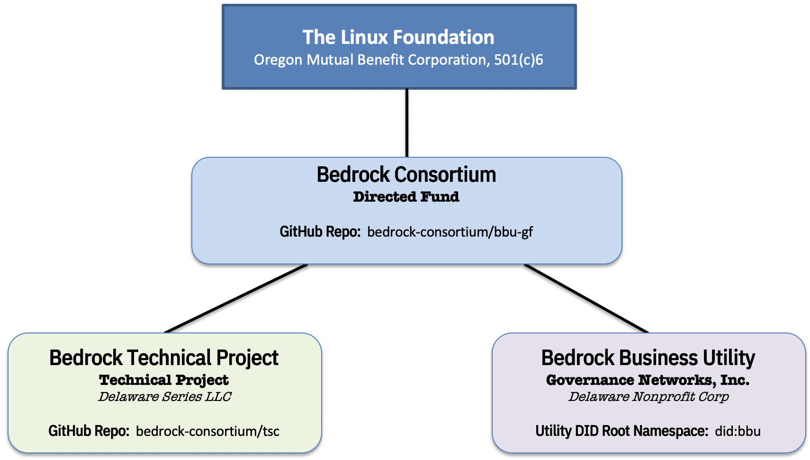
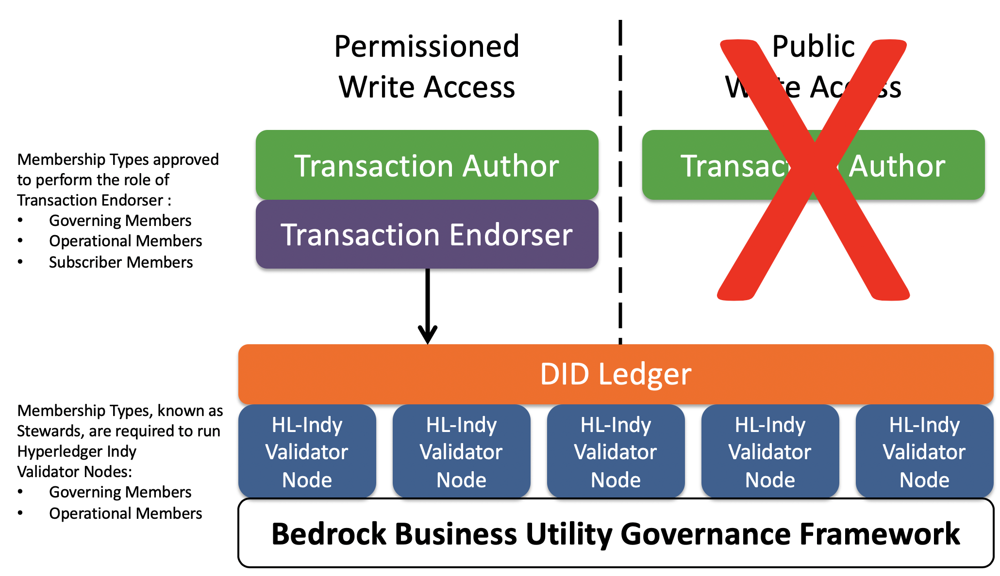

## Introduction
The Bedrock Business Utility (the "Utility") is governed by the Bedrock Consortium as a dedicated public-permissioned blockchain ledger. The nodes of this immutable Utility are hosted by a variety of business entities around the world, called Stewards. The Utility is intended to enable Transaction Authors (see below) to publish decentralized identifiers (DIDs) and other cryptographic data structures required for the issuance and verification of digital credentials.

The Utility is legally represented as three (3) distinct but related legal entities which are associated with a collection of contractual instruments. The *Bedrock Business Utility  Fund* (the “Directed Fund”), is a directed fund project of The Linux Foundation (the "LF").  The Directed Fund serves two purposes:

1. Manage the operation and maintenance of the Bedrock Business Utility (“the Utility”), a LF Operational Project (a Delaware series limited liability company)
2. Support for the Bedrock Consortium Project, (the “Technical Project”), an open source project, a LF Network Project.

It is expected that the Utility will be used primarily by businesses who have a need to exchange trusted data such as digital credentials. The credentials themselves are never written to the Utility so issuers of these credentials ( *Transaction Authors*) have no need to write data to the Utility. This approach avoids issuers increasing risks associated with personal data under data protection regulations such as the EU General Data Protection Regulation (GDPR), the Canadian Personal Information Protection and Electronic Documents Act (PIPEDA), or the California Consumer Privacy Act (CCPA).

## Data Protection
The Sovrin Foundation in conjunction with its legal counsel [Perkins Coie](https://www.perkinscoie.com/en/) published a white paper providing a detailed legal analysis of the applicability of the GDPR to the Sovrin Utility and Sovrin Network.  The [GDPR Position Paper](https://sovrin.org/wp-content/uploads/GDPR-Paper_V1.pdf) assesses data protection requirements at Layers 1-3 of the ToIP Stack.

The Bedrock Consortium recognizes this work-product as prior art given its applicability to any public identity utility. This paper is a foundational legal document for the importance of permissioned-write access to the ledger. See [Issue 16](https://github.com/bedrock-consortium/bbu-gf/issues/16) pertaining to the storage location of this paper after the transition effort of the Sovrin Foundation.

## Legal Architecture
The following figure is a visual illustration of the key roles and agreements in the Bedrock Consortium’s legal framework for regulatory compliance with data protection laws. Although it uses terms from the GDPR, it is intended for compliance with general data protection regulations.

The following sections explain the actors, roles, policies, and legal agreements depicted in this diagram. Note that formal definitions for all terms that appear in First Letter Capitals are provided in the [Glossary](../gf_info/glossary.md).

## Actors & Roles

### Bedrock Consortium
The Bedrock Consortium is an international non-profit public trust organization chartered to provide governance for the Bedrock Business Utility. Represented by the Board of Directors of the Utility, the Consortium represents the *Designated Data Controller*. In this role, the Consortium is a broker between Transaction Authors, the *Primary Data Controller*, and other Utility actors.

### Consortium Members
In order to participate in the Consortium as either a Steward, a Transaction Endorser or both; the desired participant MUST sign the Participation Agreement. This agreement allocates write access entitlements by membership level.

### Transaction Authors
A Transaction Author is any Organization who submits a Transaction to be written to the Utility. This role in the BBU-GF is available to both members and non-members. As explained below, under the Permissioned Write Access policies of the BBU-GF, only Organizations may write Transactions. Transaction Authors may write any data type supported by the Utility — see [What Goes On The Ledger?](../gf_controlled/Utility_data_polices.md)

### Transaction Endorsers
A Transaction Endorser is an Organization that has been approved by the Bedrock Consortium to endorse Transactions on behalf of Transaction Authors. The role of Transaction Endorser is specified by the Permissioned Write Access policies of the BBU-GF. Transaction Endorsers add their digital signature to a Transaction so it will be accepted and written by the Stewards. Transaction Endorsers MUST enter into both the Transaction Endorser Agreement and the Transaction Endorser Data Processing Agreement with the Bedrock Consortium.

### Subscribers
Subscribers are trusted institutions who desire to participate in the Consortium as Transaction Endorsers. This membership level allows desiring participants to procure a limited number of write transaction units on an annual basis.

### Stewards
Stewards are trusted institutions who operate a Node of the Utility. Stewards MUST meet the qualifications specified in [Member Business Policies](../gf_controlled/member_business_policies.md) and [Member Technical and Organizational Policies](../gf_controlled/member_top.md). Stewards must enter into both the Steward Agreement and the Steward Data Processing Agreement with the Bedrock Consortium. Stewards are automatically qualified to be Transaction Endorsers but they MUST sign the appropriate Transaction Endorser contracts with the Bedrock Consortium.

### Utility Access Policies

#### Permissioned Write Access
This is the set of policies that require Transaction Authors to obtain the endorsement of a Transaction Endorser in order to write a Transaction to the Utility. There are two primary reasons for the Permissioned Write Access policy:

1. It protects the Utility by requiring Transaction Endorsers, who have a direct contractual relationship with the Bedrock Consortium to enforce the Permissioned Write Access policies, to ensure that a Transaction Author Agreement is in effect and to leverage an allocated write unit as a form of payment for a Transaction. Write Units are acquired based on Membership Type.
2. It reduces the risk of Personal Data being written to the  Utility as that is currently prohibited under the Permissioned Write Access policies. The Bedrock Consortium feels this protection is necessary under the current regulatory uncertainty regarding Personal Data on an immutable public ledger. See the *Data Protection* section of this document for more details.

#### Public Write Access
Under Public Write Access policies, the requirement of a Transaction Endorser signing a Transaction Authors request is eliminated; anyone would be able to write to the Utility by following a programmatic process that aims to provide the necessary assurances against privacy compliance risks. **This form of access to the Utility is prohibited under the BBU-GF**.  

## Legal Document Architecture

### Primary Legal Agreements

#### Participation Agreement
This is the contractual agreement between the Bedrock Consortium and all members. It has been developed by the Linux Foundation in support of Directed Fund projects. This agreement is the binding agreement for all members.

#### Transaction Author Agreement
This is the contractual agreement between the Bedrock Consortium and all Transaction Authors. It has been developed specifically to protect the right of every Transaction Author to have and hold self-sovereign identity credentials while also protecting the Utility and the infrastructure provided by the Bedrock Consortium as a global public utility. It is intended to give effect to the data protection rights of all Transaction Authors while recognizing the technical and security requirements of a public-permissioned immutable Utility. As part of the Transaction Author Agreement, every Transaction Author also agrees to be bound by the terms and conditions applicable to the Transaction Author as a controller under the Steward Data Processing Agreement and the Transaction and the Transaction Endorser Agreement to include a Data Processing Agreement. The Utility itself is the authoritative record of all Transaction Author Agreement signatures.

#### Transaction Endorser Agreement
This is the contractual agreement between the Bedrock Consortium and all Transaction Endorsers. This agreement is simpler in scope than the Transaction Author Agreement. It is limited to enforcing Permissioned Write Access policies and verifying that Transaction Authors have executed the Transaction Author Agreement. The Transaction Endorser Agreement requires that the Transaction Endorser separately execute the Transaction Endorser Data Processing Agreement and includes a current version of the Transaction Author Agreement as an Appendix. This agreement **does not** address the exchange of payment (value) between the Transaction Endorser and the Transaction Author. Such usage fees associated with the allocation of write transaction entitlements is *out-of-scope* for the BBU-GF.

#### Steward Agreement
This is the contractual agreement between the Bedrock Consortium and all Stewards. It covers all the rights and obligations of the Bedrock Consortium and Stewards under the Bedrock Governance Framework. The Steward Agreement requires that the Steward separately execute the Steward Data Processing Agreement.

### Data Processing Agreements (DPAs)

#### Transaction Endorser DPA
This is the DPA required of all Transaction Endorsers acting as Data Processors for the Transaction Author as primary Data Controller and the Bedrock Consortium acting as the Designated Data Controller. It requires that the Transaction Endorser implement its own set of Technical and Operational Measures (TOMs) that MUST meet or exceed the Transaction Endorser Technical and Organizational Policies (TOPs) specified in the Bedrock Governance Framework.

#### Steward DPA
This is the DPA required of Stewards. It requires that the Steward implement its own TOMs that meets or exceeds the Steward TOPs.

### Technical and Organizational Policies (TOPs)

#### Transaction Endorser TOPs
This is the set of policies in the Bedrock Governance Framework that establish the minimum technical and organization policies and procedures that a Transaction Endorser MUST implement in its own Technical and Operational Measures (TOMs) to provide adequate security, privacy, and data protection for Transaction Authors and the Bedrock Consortium.

#### Steward TOPs
Similar to the Transaction Endorser TOPs, this is the set of policies in the Bedrock Governance Framework that establish the minimum technical and organization policies and procedures that a Steward must implement in its own Technical and Operational Measures (TOMs) to provide adequate security, privacy, and data protection for Transaction Authors and the Bedrock Consortium.
